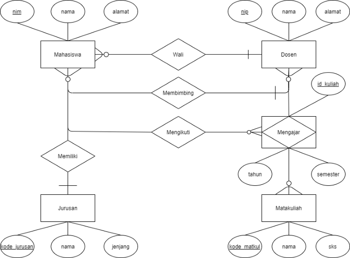

## Aplikasi Evaluasi Perkuliahan Mahasiswa

Adanya pandemi Covid-19 ini memberikan pelajaran berharga untuk kita bahwa diperlukan sebuah sistem ataupun rencana bila terjadi suatu hal yang dapat memengaruhi alur proses kerja suatu lembaga. Dalam dunia pendidikan, khususnya perkuliahan, masih terdapat beberapa institusi yang melakukan administrasi secara offline. Dari hal itulah tercetus sebuah ide untuk membuat alur birokrasi administrasi ini berjalan secara online. Aplikasi evaluasi perkuliahan mahasiswa hadir sebagai solusi untuk mempermudah birokrasi administrasi tersebut. Pada aplikasi ini, terdapat kurang lebih 3 (tiga) entitas, yakni Mahasiswa, Dosen, dan Universitas. Mahasiswa sebagai entitas utama yang membutuhkan aplikasi ini karena aplikasi ini hadir sebagai rapor seorang mahasiswa. Disana terdapat ringkasan nilai, transkrip, dan informasi-informasi yang diberikan oleh dosen maupun universitas. Dosen sebagai salah satu entitas dalam aplikasi ini berperan sebagai wali, guru, maupun pembimbing dapat memberikan penilaian kepada mahasiswa melalui aplikasi ini, yang nantinya penilaian ini akan terolah menjadi Indeks Prestasi (IP) ataupun Indeks Prestasi Kumulatif (IPK) seorang mahasiswa dan dapat dilihat oleh mahasiswa tersebut. Universitas yang juga berperan pada aplikasi ini hadir sebagai verifikator data mahasiswa dan juga verifikator pembayaran Uang Kuliah Tunggal (UKT) mahasiswa terkait. Akhirnya, diharapkan aplikasi ini dapat bermanfaat dan membantu entitas-entitas yang ada dalam institusi tersebut.

Gambar 1.  Diagram sistem aplikasi evaluasi perkuliahan mahasiswa

Penjelasan:
1. Calon mahasiswa yang dinyatakan lolos untuk melengkapi data dirinya saat penerimaan Mahasiswa
2. Data tersebut tersimpan di database dan men-generate Nomor Induk Mahasiswa (NIM), user id, dan password default
3. NIM ini adalah data unik yang dimiliki oleh tiap mahasiswa dan berisikan kode-kode tentang mahasiswa tersebut, misal kode jurusan dan fakultas
4. User id dan password default yang didapatkkan, digunakan untuk masuk di website evaluasi perkuliahan Mahasiswa
5. Pada website, berisikan data mahasiswa tersebut serta rapor selama Perkuliahan
6. Di website tersebut juga, mahasiswa dapat memilih matakuliah yang akan diambil di semester berikutnya berdasarkan Indeks Prestasi (IP) pada semester sebelumnya
7. Terdapat halaman yg berisikan diagram IP tiap semester yang nantinya akan diolah menjadi Indeks Prestasi Kumulatif (IPK)
8. Dosen yang bertindak sebagai wali, pengajar, ataupun pembimbing, dapat memberikan evaluasi dari mahasiswa yang berhubungan dengannya
9. Setelah menyelesaikan perkuliahan dan memenuhi semua syarat dan ketentuan, status mahasiswa tersebut akan berubah dan akan tercetak Ijazah yang berisikan semua data yang ada pada halaman website tersebut seperti transkrip nilai, IPK, nama lengkap, dsb

Berikut fitur-fitur yang dimiliki oleh pelaku/entitas terkait
1.  Mahasiswa
    - Verification email, password, and ID
    - Sign in
    - Read about test handbook
    - Halaman evaluasi perkuliahan:
        - ringkasan Indeks Prestasi (IP) per semester
        - ringkasan Indeks Prestasi Kumulatif (IPK) selama perkuliahan
        - transkrip nilai matakuliah yang diambil

2.	Dosen
    - Sign up
    - Verification email, password, and ID
    - Sign in
    - Halaman pemberian nilai matakuliah yang diambil oleh mahasiswa yang bersangkutan

3.  Universitas
    - Halaman untuk verifikasi pembayaran Uang Kuliah Tunggal (UKT) mahasiswa